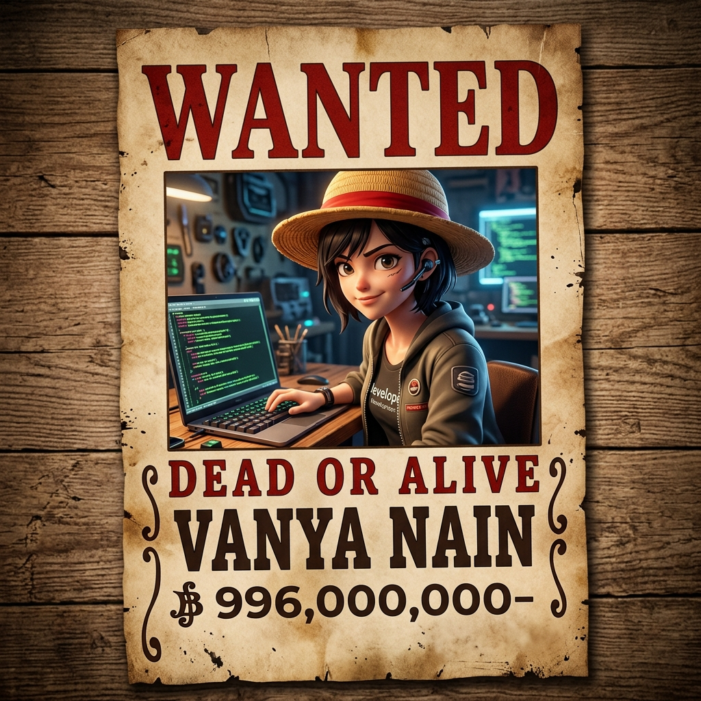

# 💫 About Me:
## Hi there 👋 - 🔭 I’m currently working on Machine Learning & Data Science projects - 🌱 I’m currently learning Advanced ML, Deep Learning, and Android Development  - 👯 I’m looking to collaborate on ML, Data Science & Java-based projects - 🤔 I’m looking for help with scaling ML models and deployment - ⚡ Fun fact: I enjoy solving real-world problems using ML models 🚀 

## 🌐 Socials:
  

# 💻 Tech Stack:
                             
# 📊 GitHub Stats:
 
 

  <!-- Widescreen Premium 3D Cover Banner -->
  

   

  <!-- Animated Floating Subtitle -->
  <h1>🏴‍☠️ Vanya Nain 🏴‍☠️</h1>
  <h3>✨ Machine Learning Adventurer & Future Queen of the Pirates ✨</h3>
  
  

    
    
    
  

<!-- Two Column Intro Section -->
<table border="0" cellpadding="10" cellspacing="0" width="100%" style="border-collapse: collapse; border: none;">
  <tr>
    <!-- Left Column: 3D Wanted Poster -->
    <td width="40%" align="center" valign="top" style="border: none;">
      
    </td>
    <!-- Right Column: Intro & Quotes -->
    <td width="60%" valign="top" style="border: none; padding-left: 20px; font-family: 'Helvetica Neue', Helvetica, Arial, sans-serif; line-height: 1.6;">
      <h3>🌊 Setting Sail on the Grand Line of Data!</h3>
      

        Welcome aboard! I am a passionate <b>Data Scientist</b>, <b>Machine Learning Engineer</b>, and <b>Android Developer</b> currently studying Computer Science and Engineering at SRM Institute of Science and Technology (Expected Graduation: 2027) with a stellar CGPA of <b>9.96</b>.
      

      

        Just like Luffy gathers a crew to seek the ultimate treasure, I compile algorithms, clean datasets, and design neural networks to uncover hidden gems within data. I enjoy solving real-world problems and creating scalable AI systems that navigate the complex seas of modern technology.
      

      
      <!-- Pirate Quotes Section -->
      

        <h4 style="color: #ffcc00; margin-top: 0; margin-bottom: 8px;">⚓ Words of the Crew</h4>
        

          "I'm doing this because I want to! It doesn't matter if I can or not."
           — Monkey D. Luffy
        

        

          "I want to live! Take me out to the sea with you!"
           — Nico Robin
        

        

          "Only those who have suffered long can see the light within the shadows."
           — One Piece
        

      

    </td>
  </tr>
</table>

 

<h2 style="color: #ffcc00; border-bottom: 2px solid #ffcc00; padding-bottom: 5px;">🗺️ The Pirate Logbook (About Me)</h2>

- 🔭 **Current Voyage (Current Work)**: Contributing to open-source and diving deep into Machine Learning & Data Science projects.
- 🌱 **Navigation & Training (Learning)**: Charting courses in Advanced ML, Deep Learning, and mobile Android Development.
- 👯 **Alliance Requests (Collaboration)**: Ready to join alliances for ML, Data Science & Java-based projects.
- 🤔 **Seeking Log Pose (Help Needed)**: Looking for guidance on scaling large-scale ML models and cloud deployment strategies.
- ⚡ **Bounty (Fun Fact)**: I enjoy solving real-world challenges using ML models 🚀

 

<h2 style="color: #ffcc00; border-bottom: 2px solid #ffcc00; padding-bottom: 5px;">🧠 Devil Fruits & Haki (Tech Stack)</h2>

<table width="100%" style="border-collapse: collapse; border: none;">
  <tr>
    <td valign="top" width="33%" style="border: none;">
      <h3 style="color: #ff3333;">🧠 Devil Fruits (Languages)</h3>
       
       
       
      
    </td>
    <td valign="top" width="34%" style="border: none;">
      <h3 style="color: #ffcc00;">🔮 Haki (ML, DL & AI)</h3>
       
       
       
       
       
       
      
    </td>
    <td valign="top" width="33%" style="border: none;">
      <h3 style="color: #38bdf8;">🛠️ Grand Line Gear (Dev & Cloud)</h3>
       
       
       
       
       
       
      
    </td>
  </tr>
</table>

 

<h2 style="color: #ffcc00; border-bottom: 2px solid #ffcc00; padding-bottom: 5px;">🏴‍☠️ Legendary Voyages (Featured Projects)</h2>

<!-- Project Cards Grid -->
<table width="100%" style="border-collapse: collapse; border: none; font-family: sans-serif;">
  <tr>
    <!-- Project 1 -->
    <td width="50%" valign="top" style="padding: 10px; border: none;">
      

        <h4 style="color: #ffcc00; margin-top: 0; margin-bottom: 10px;">💳 Credit Card Fraud Detection</h4>
        

          Built a robust transaction fraud detection system utilizing machine learning, designed to shield data assets from pirate thieves using LightGBM and hyperparameter optimization.
        

        

          🛠️ Python • Scikit-learn • LightGBM
        

      

    </td>
    <!-- Project 2 -->
    <td width="50%" valign="top" style="padding: 10px; border: none;">
      

        <h4 style="color: #ff3333; margin-top: 0; margin-bottom: 10px;">📈 Stock Price Prediction Dashboard</h4>
        

          Developed an intelligent forecasting dashboard to predict stock trends using LSTM neural networks, aiding in navigating volatile market waters.
        

        

          🛠️ Python • TensorFlow • LSTM • Streamlit
        

      

    </td>
  </tr>
  <tr>
    <!-- Project 3 -->
    <td width="50%" valign="top" style="padding: 10px; border: none;">
      

        <h4 style="color: #38bdf8; margin-top: 0; margin-bottom: 10px;">💼 Portfolio Optimisation Dashboard</h4>
        

          Constructed a financial dashboard inspired by Modern Portfolio Theory, optimizing returns and risk parameters to allocate digital gold wisely.
        

        

          🛠️ Python • PyPortfolioOpt • Plotly
        

      

    </td>
    <!-- Project 4 -->
    <td width="50%" valign="top" style="padding: 10px; border: none;">
      

        <h4 style="color: #ffcc00; margin-top: 0; margin-bottom: 10px;">🤖 Reinforcement Learning Trading Agent</h4>
        

          An autonomous trading bot designed to explore market oceans and navigate trading decisions using Deep Q-Networks (DQN) and Proximal Policy Optimization (PPO).
        

        

          🛠️ Python • PyTorch • Stable-Baselines3
        

      

    </td>
  </tr>
  <tr>
    <!-- Project 5 (Centered span) -->
    <td colspan="2" valign="top" style="padding: 10px; border: none;">
      

        <h4 style="color: #ff3333; margin-top: 0; margin-bottom: 10px;">📱 Smart Wallet — AI Expense Manager</h4>
        

          An advanced Android application designed to track every single Berry spent on your voyage! Features real-time AI OCR receipt scanning, intelligent budget categorization, and cloud synchronization.
        

        

          🛠️ Java • Android Studio • Firebase • ML Kit OCR • Azure
        

      

    </td>
  </tr>
</table>

 

<h2 style="color: #ffcc00; border-bottom: 2px solid #ffcc00; padding-bottom: 5px;">📊 The Bounty Board (GitHub Stats)</h2>

  <!-- Stats Cards aligned with custom One Piece colors (Gold headers, white text, red accents, black background) -->
  <table border="0" cellpadding="5" cellspacing="0">
    <tr>
      <td>
        
      </td>
      <td>
        
      </td>
    </tr>
    <tr>
      <td colspan="2" align="center" style="padding-top: 10px;">
        
      </td>
    </tr>
  </table>

 

  
🌟 <i>"Inherited Will, The Destiny of Age, and The Dreams of People. As long as people continue to pursue the meaning of Freedom, these things will never cease to be!"</i> — <b>Gol D. Roger</b>

  
🤖 Designed with 💖 and 🏴‍☠️ spirit. Feel free to leave a star on this profile repository! 🌟

<!-- Proudly created with GPRM ( https://gprm.itsvg.in ) -->
<!--
**Vanyanain/Vanyanain** is a ✨ _special_ ✨ repository because its `README.md` (this file) appears on your GitHub profile.

Here are some ideas to get you started:

- 🔭 I’m currently working on ...
- 🌱 I’m currently learning ...
- 👯 I’m looking to collaborate on ...
- 🤔 I’m looking for help with ...
- 💬 Ask me about ...
- 📫 How to reach me: ...
- 😄 Pronouns: ...
- ⚡ Fun fact: ...
-->
